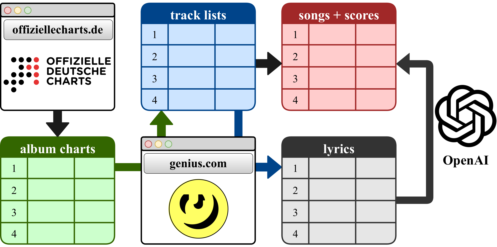

# Behind the Beats: Curation of a Dataset for Exploring German Rap Language



## Abstract

Rap music is one of the most influential contemporary music genres with a huge societal significance.
Existing analyses of rap often rely on self-performed web scraping approaches and do not take popularity of songs into
account. In this work, we contribute a novel dataset for German rap lyrics analysis, comprising 13,997 songs that
achieved high chart positions during the years 2015-2023. Each song is further annotated with moderation labels,
reflecting the presence of harassment, violence, sexuality, hate and self-harm, enabling analysis of harmful or explicit
content within German rap. The proposed dataset opens up the possibility to explore individual artists’ lyrical styles
as well as the temporal development of German rap. The data and code are made publicly available for further research1.

## Setup

Create python venv with python 3.10 and install requirements:

```bash
python3.10 -m venv venv
source venv/bin/activate
pip install -r requirements.txt
```

Copy the file .env.base to .env and fill in the secrets.

```text
GENIUS_TOKEN='REPLACE_ME'
OPENAI_API_KEY='REPLACE_ME'
```

## Running the scraping pipeline

The main script for scraping the data can be found in `src/main.py`.

Run the script with:

```bash
python src/main.py
```

## Accessing the data

The scraped data is stored in the `data` folder:

- `data/csv/charts.csv`: Dataset with the scraped charts data.
- `data/csv/songs.csv`: Dataset with the scraped songs data (no lyrics).
- `data/csv/moderation.csv`: Dataset with the content moderation predictions.
- `data/lyrics.zip`: Zip file with the scraped lyrics.

## Experiments

The experiments are stored in the `experiments` folder:

- `experiments/exp_PD_001_AlgorithmicAnalysis.ipynb`: Notebook with the algorithmic analysis of the moderation labels.
- `experiments/exp_PD_002_DeToxAnalysis.ipynb`: Notebook with the analysis of the DeTox hate speech labels.

Results of the experiments are stored in the `data/experiments` folder.

## Docs

The scripts for creating visualizations for the paper can be found in `doc/data_lit_23-24_paper/fig`.
